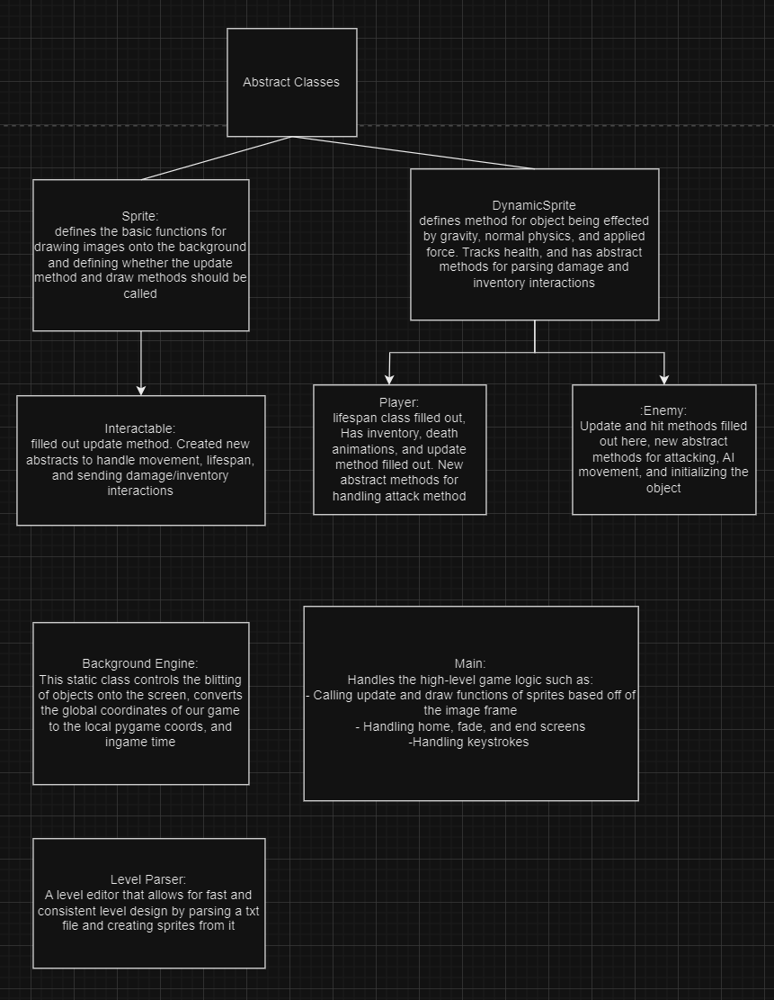

# Castlevania III Remix - 1980's Game Project

Our project is a 2D action platformer game based on the NES Castlevania video game. 

## Overview

Castlevania III is a 2D action/story-based platformer game, released in 1989. The game takes a player through various stages to ultimately achieve an end goal. Throughout the game, various obstacles, include platforms and enemies, obstruct the player's path. Other items, like candles and weapons, help the player traverse through the map. The game has a tight movement system to keep the difficulty high and prevent rapid progression. There is a simply weapon inventory, and some form of interaction about every 3 seconds. Additionally, there are objects scattered around the map that the user must find in order to more easily progress through difficult stages. 

In replicating Castlevania, we made two major twists. The first is our storyline. The original Castlevania III revolved around Trevor Belmont hunting down Draculas in 15th Century Europe. We implemented a Hansel & Gretel theme (from the Brothers' Grimm). The pair are searching for food amidst a famine when they are captured by a witch, and seperated. Gretel finds herself trapped in a dungeon, needing to escape and find her brother. By changing the storyline, we needed to change the artwork for the background, characters, and sprites, to match the story. We maintained the dark tone of the original Castlevania III, as it matched the storyline of Hansel & Gretel. Our second twist was to change the physics system. The original Castlevania is extremely rigid: there is a fixed speed, a very strong gravitational force, and limited movement in the air. We wanted to replicate a real-world physics system, which meant implementing a friction force, along with a weaker gravitational force. This allows the player to accelerate, decelerate, and slide. The player can also jump to higher platforms; however, movement in the air is still prohibited to preserve that element from the original game. 

When designing the game, we initially sought to make one large level that demonstrated aspects of the entire Castlevania game. This includes platforms, interactable objects, enemies, and a final boss. However, when discussing the user-experience, we felt that seperating these aspects into multiple levels would allow a player to 'discover' how to move and feel out the game. So, we created multiple levels. The initial ones involve basic movement and interactions, with each subsequent level including new game features (like platforms) and more advanced enemies. Thelevels are connected through doors, which are placed at the end of the stage. We also included the score box at the top of the screen from the original game, along with an opening and closing window, and a screen that explains the game controls. These were choices that make a user feel like they are playing a developed and released game. 

To run the game, you will need to run the **Main.py** file in the **main** branch. If the window is too big for your screen, you can adjust the variable **size** in Constants/window_constants.py. ***Do not change any other variable in this file!*** The window will have instructions on how to move through the game with a keyboard. At the end of the game, simply close the window and re-run the program if you want to play again. 

## Architecture

Powered by Pygame (ofc)
## User Experience

There is a good chance a first-time user is actually quite comfortable with the game. The platformer aspects of Castlevania, although not exactly the same, can be seen in popular games, like Geometry Dash. A first-time user will probably understand to move throughout the stage and interact with objects on the map. However, the user will have to discover certain interactions through the game, such as destroying candles to gain extra health. Information on how to use certain commands is given at the start, but the purpose of features like attacking and sliding is not explicitly stated. This is intended to preserve the exploratory feel of the original Castlevania. The goal of our game is for a first-time user to not feel overwhelmed by the game mechanics, but to have to figure out how to progress through difficult stages. 

As said before, there is an element of mystery to the game. A more experienced player would understand how certain interactions work in order to progress through stages quicker. 

## Retrospective
